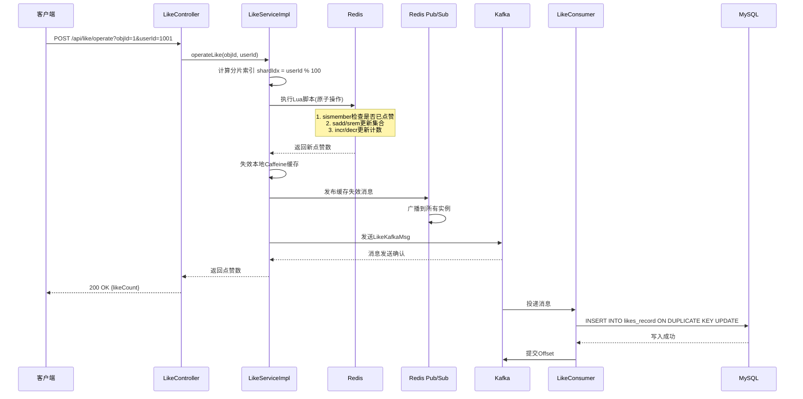
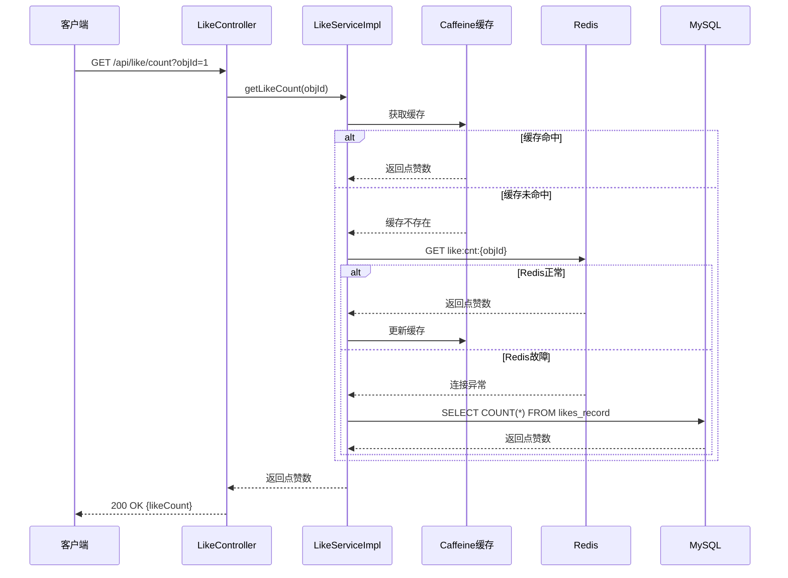
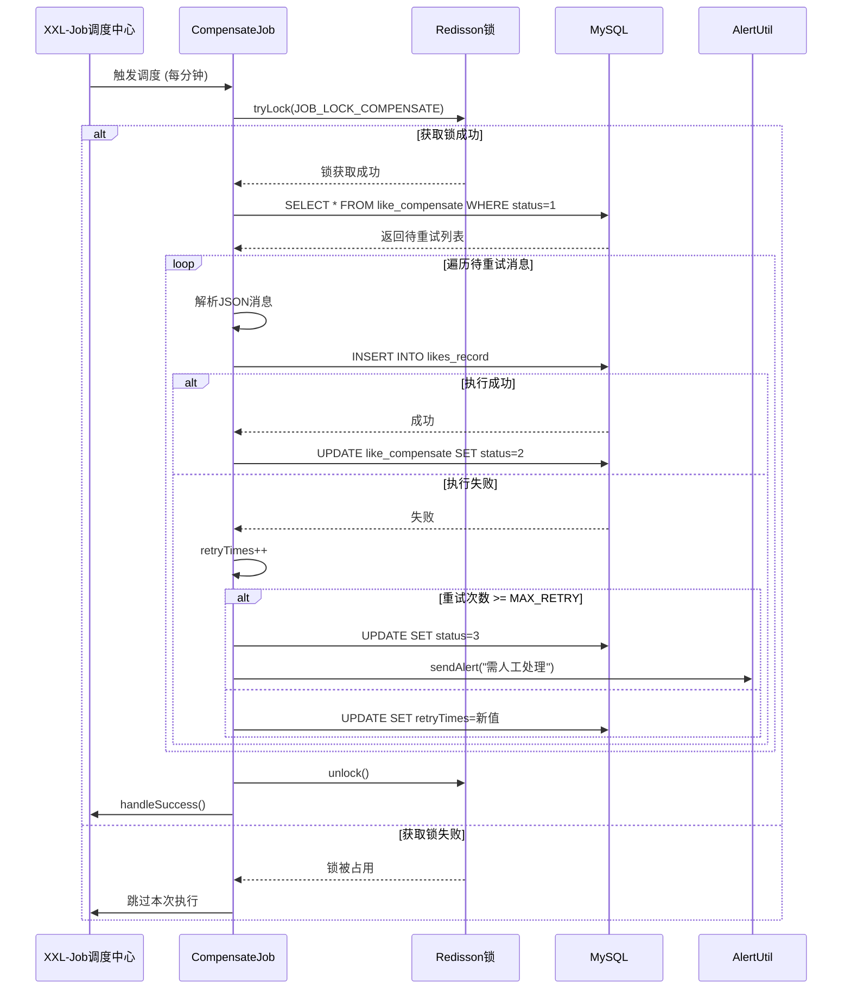

# 高并发点赞系统 - 技术方案文档

## 一、业务背景

### 1.1 业务需求分析

随着业务发展，用户对内容互动的需求日益增长，点赞功能作为核心互动方式，面临以下挑战：

| 挑战类型 | 具体表现 | 技术要求 |
|---------|---------|---------|
| 高并发读写 | 热点内容点赞量可达每秒数万次 | 支持10万+ QPS写入 |
| 数据一致性 | Redis与MySQL数据需保持最终一致 | 异步消息+补偿机制 |
| 缓存一致性 | 多实例部署下本地缓存需同步失效 | Redis Pub/Sub广播 |
| 分布式任务 | 定时任务需保证集群单实例执行 | XXL-Job + Redisson锁 |
| 故障降级 | 主存储故障时需保证服务可用 | Redis→MySQL降级 |

### 1.2 核心业务场景

- **点赞/取消点赞**：用户对文章/评论进行点赞或取消点赞操作
- **点赞数查询**：获取指定内容的点赞数量
- **点赞状态检查**：检查用户是否已点赞某内容
- **数据对账**：定时校验Redis与MySQL数据一致性
- **消息补偿**：重试消费失败的Kafka消息

---

## 二、系统架构

### 2.1 整体架构图

```
┌─────────────────────────────────────────────────────────────────────────┐
│                          客户端层                                       │
│  ┌────────────┐  ┌────────────┐  ┌────────────┐                        │
│  │   Web App  │  │  Mobile    │  │   API      │                        │
│  └─────┬──────┘  └─────┬──────┘  └─────┬──────┘                        │
└───────┬────────────────┼────────────────┬──────────────────────────────┘
        │                │                │
        ▼                ▼                ▼
┌─────────────────────────────────────────────────────────────────────────┐
│                         网关层                                          │
│                    Nginx / API Gateway                                  │
└──────────────────────────────┬──────────────────────────────────────────┘
                               │
         ┌─────────────────────┼─────────────────────┐
         ▼                     ▼                     ▼
┌─────────────────┐  ┌─────────────────┐  ┌─────────────────┐
│   SpringBoot    │  │   SpringBoot    │  │   SpringBoot    │
│    Instance 1   │  │    Instance 2   │  │    Instance N   │
│                 │  │                 │  │                 │
│  ┌──────────┐   │  │  ┌──────────┐   │  │  ┌──────────┐   │
│  │Controller│   │  │  │Controller│   │  │  │Controller│   │
│  └────┬─────┘   │  │  └────┬─────┘   │  │  └────┬─────┘   │
│       │         │  │       │         │  │       │         │
│  ┌────▼────┐    │  │  ┌────▼────┐    │  │  ┌────▼────┐    │
│  │ Service │    │  │  │ Service │    │  │  │ Service │    │
│  └────┬────┘    │  │  └────┬────┘    │  │  └────┬────┘    │
│       │         │  │       │         │  │       │         │
│  ┌────▼────┐    │  │  ┌────▼────┐    │  │  ┌────▼────┐    │
│  │Caffeine │    │  │  │Caffeine │    │  │  │Caffeine │    │
│  │  Cache  │    │  │  │  Cache  │    │  │  │  Cache  │    │
│  └────┬────┘    │  │  └────┬────┘    │  │  └────┬────┘    │
└───────┼─────────┘  └───────┼─────────┘  └───────┼─────────┘
        │                    │                    │
        └────────────────────┼────────────────────┘
                             ▼
┌─────────────────────────────────────────────────────────────────────────┐
│                         缓存层                                          │
│                       Redis Cluster                                     │
│  ┌───────────────┐    ┌───────────────┐    ┌───────────────┐          │
│  │  like:cnt:*  │    │  like:set:*   │    │ Pub/Sub Channel│          │
│  │   (String)   │    │    (Set)      │    │  (Broadcast)  │          │
│  └───────────────┘    └───────────────┘    └───────────────┘          │
└──────────────────────────────┬──────────────────────────────────────────┘
                               │
         ┌─────────────────────┼─────────────────────┐
         ▼                     ▼                     ▼
┌─────────────────┐  ┌─────────────────┐  ┌─────────────────┐
│   Kafka Broker  │  │   Kafka Broker  │  │   Kafka Broker  │
│      Topic      │  │      Topic      │  │      Topic      │
│   topic_like    │  │   topic_like    │  │   topic_like    │
└─────────────────┘  └─────────────────┘  └─────────────────┘
                               │
                               ▼
┌─────────────────────────────────────────────────────────────────────────┐
│                         持久化层                                        │
│                       MySQL Cluster                                     │
│  ┌───────────────────────────────────────────────────────────────────┐  │
│  │  likes_record     │  like_compensate         │                     │  │
│  │  (点赞归档表)      │  (消息补偿表)             │                     │  │
│  └───────────────────────────────────────────────────────────────────┘  │
└─────────────────────────────────────────────────────────────────────────┘
                               │
                               ▼
┌─────────────────────────────────────────────────────────────────────────┐
│                         调度中心                                        │
│                       XXL-Job Admin                                     │
│  ┌───────────────────────────────────────────────────────────────────┐  │
│  │  likeCompensateJobHandler  │  likeDataCheckJobHandler            │  │
│  │  (补偿重试任务)             │  (数据对账任务)                      │  │
│  └───────────────────────────────────────────────────────────────────┘  │
└─────────────────────────────────────────────────────────────────────────┘
```

### 2.2 模块划分

| 模块 | 职责 | 关键类 |
|------|------|--------|
| **controller** | REST API入口，参数校验 | LikeController |
| **service** | 业务逻辑编排 | LikeService, LikeServiceImpl |
| **mapper** | 数据访问层 | LikesRecordMapper, LikeCompensateMapper |
| **entity** | 数据库实体 | LikesRecord, LikeCompensate |
| **mq** | Kafka消息处理 | LikeProducer, LikeConsumer, LikeKafkaMsg |
| **job** | XXL-Job任务 | CompensateJob, DataCheckJob |
| **config** | 配置类 | RedisConfig, CaffeineConfig, XxlJobConfig |
| **util** | 工具类 | ShardUtil, AlertUtil |
| **constant** | 常量定义 | CommonConst, RedisKeyConst |

### 2.3 核心技术栈

| 分类 | 技术 | 版本 | 选型理由 |
|------|------|------|---------|
| 语言 | Java | 1.8 | 稳定性好，生态成熟 |
| 框架 | Spring Boot | 2.7.x | 社区成熟，生态完善 |
| ORM | MyBatis-Plus | 3.5.x | 简化CRUD，支持Lambda |
| 缓存 | Redis | 7.x | 高并发读写，支持Lua脚本 |
| 本地缓存 | Caffeine | 3.1.x | 高性能本地缓存 |
| 消息队列 | Kafka | 3.x | 高吞吐，低延迟 |
| 分布式锁 | Redisson | 3.23.x | 分布式锁实现成熟 |
| 任务调度 | XXL-Job | 2.4.x | 分布式任务管理 |

---

## 三、核心流程图

### 3.1 点赞/取消点赞流程



### 3.2 点赞数查询流程（带降级）



### 3.3 补偿重试流程



---

## 四、对外HTTP接口

### 4.1 接口总览

| API路径 | HTTP方法 | Controller文件 | 功能描述 |
|---------|---------|---------------|---------|
| `/api/like/operate` | POST | LikeController.java | 执行点赞/取消点赞 |
| `/api/like/count` | GET | LikeController.java | 获取点赞数 |
| `/api/like/check` | GET | LikeController.java | 检查点赞状态 |

### 4.2 接口详细定义

#### 4.2.1 点赞/取消点赞

**请求：**
```http
POST /api/like/operate?objId=1&userId=1001
```

**参数：**

| 参数名 | 类型 | 必填 | 说明 |
|--------|------|------|------|
| objId | Long | 是 | 业务对象ID（文章/评论ID） |
| userId | Long | 是 | 用户ID |

**成功响应（200 OK）：**
```json
12345
```
返回值为最新点赞数

#### 4.2.2 获取点赞数

**请求：**
```http
GET /api/like/count?objId=1
```

**参数：**

| 参数名 | 类型 | 必填 | 说明 |
|--------|------|------|------|
| objId | Long | 是 | 业务对象ID |

**成功响应（200 OK）：**
```json
12345
```
返回值为点赞数量

#### 4.2.3 检查点赞状态

**请求：**
```http
GET /api/like/check?objId=1&userId=1001
```

**参数：**

| 参数名 | 类型 | 必填 | 说明 |
|--------|------|------|------|
| objId | Long | 是 | 业务对象ID |
| userId | Long | 是 | 用户ID |

**成功响应（200 OK）：**
```json
true
```
- `true`: 用户已点赞
- `false`: 用户未点赞

---

## 五、配置说明

### 5.1 application.yml 关键配置

```yaml
server:
  port: 8080

spring:
  # Redis配置
  redis:
    host: 127.0.0.1
    port: 6379
    password: 
    database: 0
  
  # Kafka配置（关闭原生重试）
  kafka:
    bootstrap-servers: 127.0.0.1:9092
    producer:
      key-serializer: org.apache.kafka.common.serialization.StringSerializer
      value-serializer: org.springframework.kafka.support.serializer.JsonSerializer
      retries: 2
      acks: 1
    consumer:
      group-id: like-consumer-group
      enable-auto-commit: false
      max-poll-records: 50
      properties:
        retry.max.attempts: 0
        max.retry.backoff.ms: 0

  # MySQL数据源
  datasource:
    url: jdbc:mysql://localhost:3306/example_db?useUnicode=true&characterEncoding=utf8&serverTimezone=Asia/Shanghai
    username: root
    password: password

# XXL-Job配置
xxl:
  job:
    admin:
      addresses: http://127.0.0.1:8081/xxl-job-admin
    executor:
      appname: like-system-executor
      port: 9999
      logpath: /data/xxl-job/logs
      logretentiondays: 7

# MyBatis-Plus配置
mybatis-plus:
  mapper-locations: classpath:mybatis/mapper/*.xml
  configuration:
    map-underscore-to-camel-case: true
```

### 5.2 XXL-Job 任务配置

| 任务名称 | Job Handler | Cron表达式 | 说明 |
|---------|------------|-----------|------|
| 补偿重试任务 | `likeCompensateJobHandler` | `0/1 * * * * ?` | 每分钟执行，重试失败消息 |
| 数据对账任务 | `likeDataCheckJobHandler` | `0 0 * * * ?` | 每小时执行，校验数据一致性 |

### 5.3 数据库表结构

#### 5.3.1 点赞归档表 `likes_record`

```sql
CREATE TABLE likes_record (
    id BIGINT AUTO_INCREMENT PRIMARY KEY,
    obj_id BIGINT NOT NULL COMMENT '业务对象ID',
    user_id BIGINT NOT NULL COMMENT '用户ID',
    status TINYINT NOT NULL COMMENT '1-点赞 0-取消点赞',
    create_time DATETIME NOT NULL DEFAULT CURRENT_TIMESTAMP,
    UNIQUE KEY uk_obj_user (obj_id, user_id)
) ENGINE=InnoDB DEFAULT CHARSET=utf8mb4 COMMENT='点赞冷数据归档表';
```

#### 5.3.2 消息补偿表 `like_compensate`

```sql
CREATE TABLE like_compensate (
    id BIGINT AUTO_INCREMENT PRIMARY KEY,
    msg_body JSON NOT NULL COMMENT '原始Kafka消息',
    retry_times INT NOT NULL DEFAULT 0 COMMENT '已重试次数',
    status TINYINT NOT NULL DEFAULT 1 COMMENT '1-待重试 2-成功 3-人工处理',
    error_msg VARCHAR(1000) COMMENT '异常信息',
    create_time DATETIME NOT NULL DEFAULT CURRENT_TIMESTAMP,
    update_time DATETIME NOT NULL DEFAULT CURRENT_TIMESTAMP ON UPDATE CURRENT_TIMESTAMP,
    INDEX idx_status_retry (status, retry_times)
) ENGINE=InnoDB DEFAULT CHARSET=utf8mb4 COMMENT='Kafka消费补偿表';
```

### 5.4 Redis Key 设计

| Key模板 | 存储类型 | 说明 |
|--------|---------|------|
| `like:cnt:{objId}` | String | 点赞总数 |
| `like:set:{objId}:{shardIdx}` | Set | 点赞用户ID集合（分片存储） |

---

## 六、核心设计要点

### 6.1 Redis Lua脚本（原子操作）

文件路径：`src/main/resources/lua/like_operate.lua`

```lua
local countKey = KEYS[1]   -- like:cnt:{objId}
local setKey = KEYS[2]     -- like:set:{objId}:{shardIdx}
local userId = ARGV[1]

local isExist = redis.call('sismember', setKey, userId)
if isExist == 1 then
    redis.call('srem', setKey, userId)  -- 取消点赞
    redis.call('decr', countKey)
else
    redis.call('sadd', setKey, userId)  -- 点赞
    redis.call('incr', countKey)
end
return redis.call('get', countKey)
```

### 6.2 缓存失效机制

```
实例A: invalidate(cacheKey) + publish(channel, cacheKey)
                          │
                          ▼
              Redis Pub/Sub Channel
                          │
        ┌─────────────────┼─────────────────┐
        ▼                 ▼                 ▼
    实例B接收          实例C接收          实例D接收
    invalidate()      invalidate()      invalidate()
```

### 6.3 分布式锁使用

| 锁Key | 用途 | 超时时间 |
|------|------|---------|
| `like:job:compensate:lock` | 补偿任务分布式锁 | 70秒 |
| `like:job:check:lock` | 对账任务分布式锁 | 3700秒 |

---

## 七、代码安全性

### 7.1 注意事项

| 风险点 | 风险描述 | 关联模块 |
|--------|---------|---------|
| Redis注入 | Lua脚本参数未校验可能导致注入 | RedisConfig, LikeServiceImpl |
| SQL注入 | 动态SQL拼接可能导致注入 | Mapper层 |
| 分布式锁超时 | 锁超时导致重复执行 | Job层 |
| 消息重复消费 | Kafka消息可能重复投递 | LikeConsumer |
| 敏感信息泄露 | 日志打印敏感数据 | 全局日志 |

### 7.2 解决方案

| 风险点 | 解决方案 |
|--------|---------|
| Redis注入 | 使用RedisTemplate的execute方法，自动参数化 |
| SQL注入 | 使用MyBatis-Plus参数绑定，禁止字符串拼接 |
| 分布式锁超时 | 设置合理超时时间，使用tryLock而非lock |
| 消息重复消费 | MySQL使用ON DUPLICATE KEY UPDATE保证幂等 |
| 敏感信息泄露 | 日志脱敏处理，禁止打印完整请求体 |

---

## 八、部署与运维

### 8.1 依赖服务启动顺序

1. **Redis** → 主存储
2. **Kafka** → 消息队列
3. **MySQL** → 持久化存储
4. **XXL-Job Admin** → 任务调度中心
5. **应用服务** → SpringBoot实例

### 8.2 监控指标

| 指标 | 监控目标 | 告警阈值 |
|------|---------|---------|
| Redis命中率 | 缓存有效性 | < 90% |
| Kafka消息堆积 | 消息消费能力 | > 1000条 |
| 补偿表待处理数 | 补偿能力 | > 100条 |
| 接口响应时间 | 服务性能 | P99 > 200ms |

### 8.3 故障排查流程

```
用户反馈点赞失败
        │
        ▼
检查服务日志 → 确认错误类型
        │
   ┌────┴────┐
   │         │
Redis错误   Kafka错误
   │         │
   ▼         ▼
检查Redis   检查Kafka
连接状态    Topic状态
   │         │
   └────┬────┘
        │
        ▼
检查补偿表 → 确认失败消息
        │
        ▼
手动重试或等待自动补偿
```